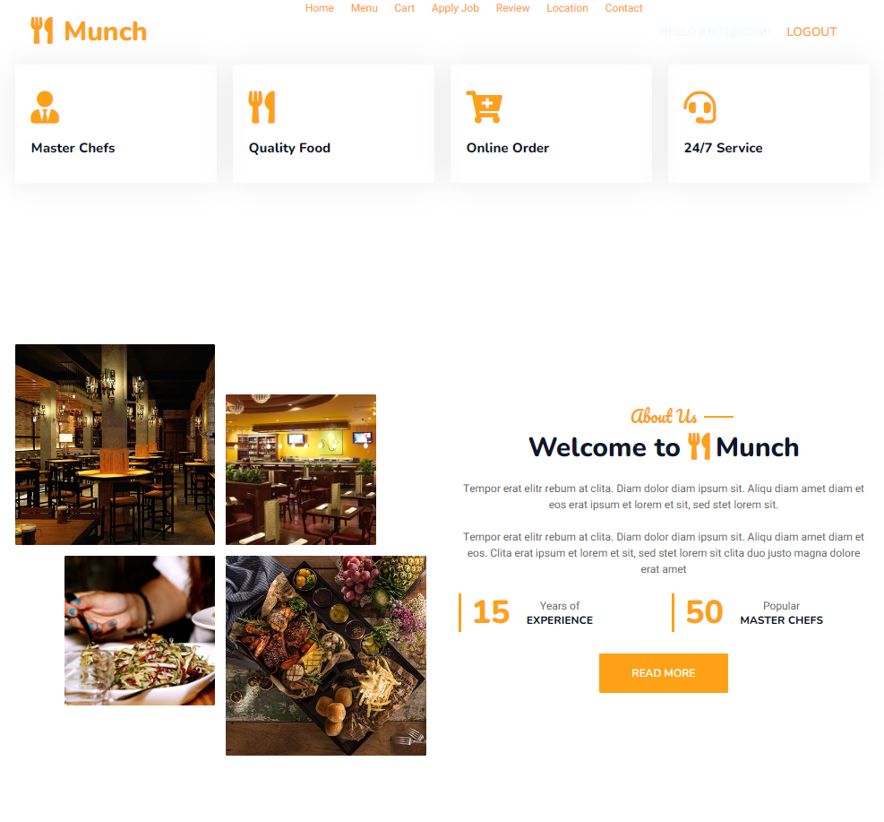
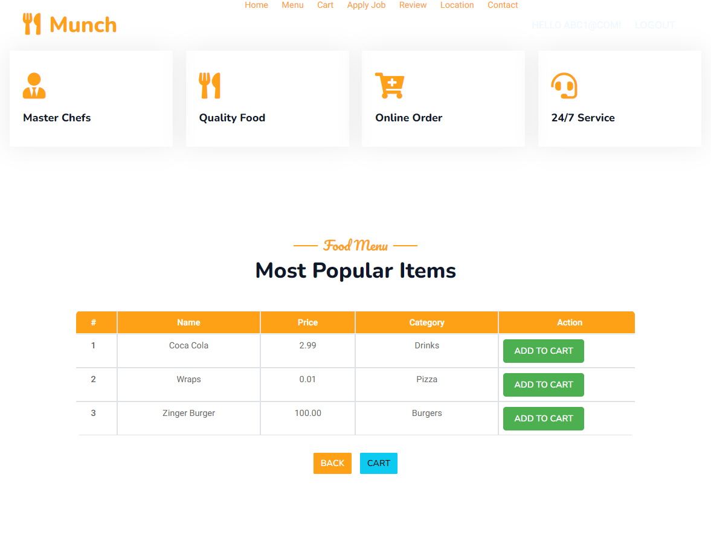
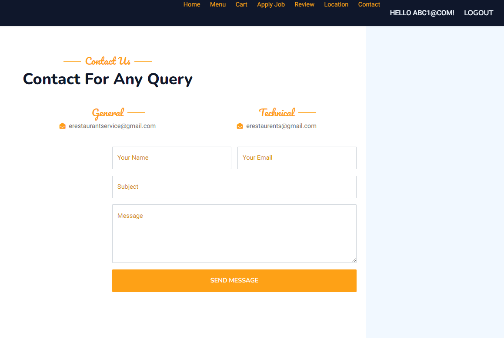

# ERestaurant-FoodWebsite
This is an ASP.net MVC Core Project built in .net 8.0

# Setup:
1. Install the required Packages.
2. Create a MSSQL Database named 'ERestaurant'.
3. Link your SQL Server to the project in appsettings.json
4. Add Migrations and Update Database.
5. Build the project and RUN.
6. To integrate email configuration change email credentials in Controlllers Code.

# Functionalities:
**User:**  
Login/Register.  
Add/Remove Items from Cart.  
Manage Cart.  
Confirm Order.  
Add Reviews.  
Apply for Job.  
Track Location.  
Contact.  
**Admin:**  
Login ("user@example.com", pass:password123  
Manage Items.  
Manage Categories.  
